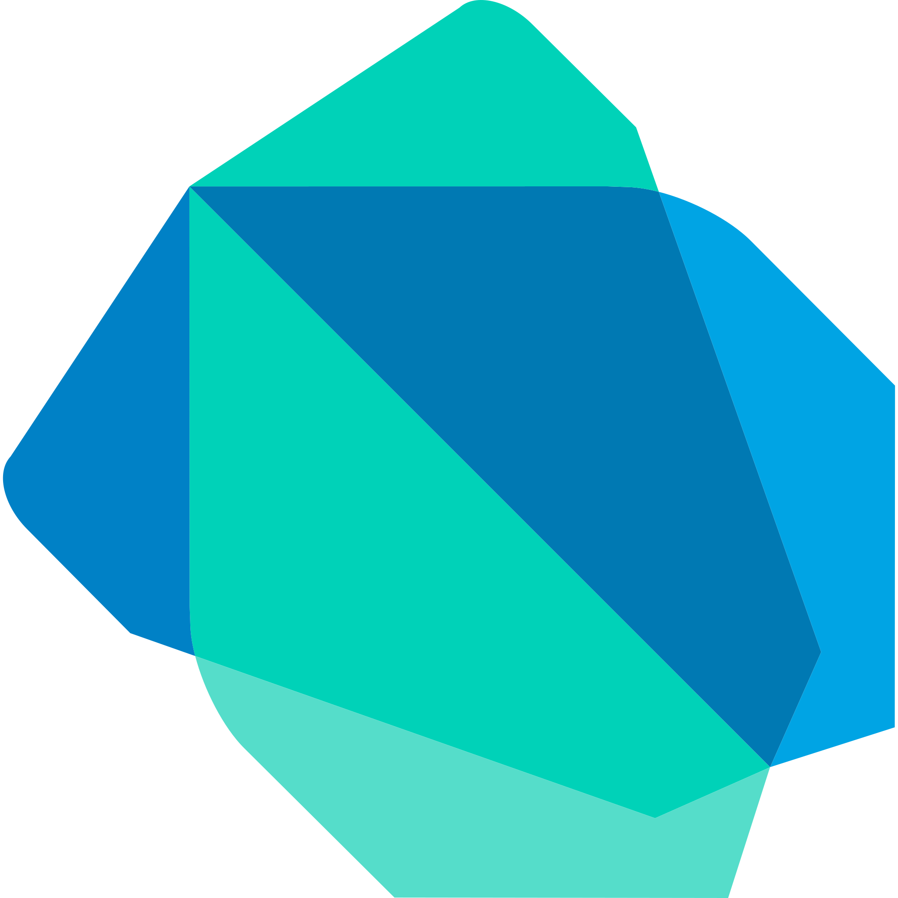

[](https://git.io/typing-svg)

[](https://www.linkedin.com/in/thinhle19/)
[](https://www.upwork.com/freelancers/~01f12733a7302716a2)
[](https://www.facebook.com/ltthinh19/)


<p align="center">
  <b>I'm a musicalholic geek</b>
</p>


<br>

- ♍ I love the process of creating things from my 10 fingers and watch them create benefits.
- 📓 I'm a student of [VNU HCMC FPT University](https://hcmuni.fpt.edu.vn).
- 🌱 I’m currently focusing on **Backend Development**.
- Show ❤ by giving ⭐ to my Repositories, at least your star could make someone's day 😄.

<!-- Tech stack -->
<h2>Tech stack 🔭</h2>
<p align="center">
  <b>Languages</b>
  <br>
  <br>
  <a href="https://en.wikipedia.org/wiki/C_(programming_language)" target="_blank">
    <code></code>
  </a>
  <a href="https://www.java.com" target="_blank">
    <code></code>
  </a>
  <a href="https://docs.microsoft.com/en-us/dotnet/csharp/" target="_blank">
    <code></code>
  </a>
  <a href="https://dart.dev/" target="_blank">
    <code></code>
  </a>
  <a href="https://developer.mozilla.org/en-US/docs/Web/JavaScript" target="_blank">
    <code></code>
  </a>
  <a href="https://www.python.org/" target="_blank">
    <code></code>
  </a>
</p>

<br>
<br>

<p align="center">
  <b>Backend</b>
  <br>
  <br>
  <a href="https://spring.io/" target="_blank">
    <code></code>
  </a> 
  <a href="https://dotnet.microsoft.com/en-us/" target="_blank">
    <code></code>
  </a> 
  <a href="https://laravel.com/" target="_blank">
    <code></code>
  </a> 
</p>

<br>
<br>

<p align="center">
  <b>Databases</b>
  <br>
  <br>
  <a href="https://www.wikiwand.com/en/Microsoft_SQL_Server" target="_blank">
    <code></code>
  </a>
  <a href="https://www.mysql.com/" target="_blank">
    <code></code>
  </a>
  <a href="https://firebase.google.com/" target="_blank">
    <code></code>
  </a>
</p>

<br>
<br>

<p align="center">
  <b>DevOps</b>
  <br>
  <br>
  <a href="https://www.docker.com/" target="_blank">
    <code></code>
  </a>
  <a href="https://nginx.org/en/" target="_blank">
    <code></code>
  </a>
  <a href="https://aws.amazon.com/" target="_blank">
    <code></code>
  </a>
  <a href="https://azure.microsoft.com/en-gb/" target="_blank">
    <code></code>
  </a>
  <a href="https://kubernetes.io/" target="_blank">
    <code></code>
  </a>
  <a href="https://sonarcloud.io/login" target="_blank">
    <code></code>
  </a>
</p>

<br>
<br>

<p align="center">
  <b>Frontend</b>
  <br>
  <br>
  <a href="https://developer.mozilla.org/en-US/docs/Web/HTML" target="_blank">
    <code></code>
  </a>
  <a href="https://developer.mozilla.org/en-US/docs/Web/CSS" target="_blank">
    <code></code>
  </a>
  <a href="https://react.dev/" target="_blank">
    <code></code>
  </a>
  <a href="https://mui.com/material-ui/" target="_blank">
    <code></code>
  </a>
  <a href="https://flutter.dev/" target="_blank">
    <code></code>
  </a>
  <br>
</p>

<br>
<br>
<!-- My activity -->
<h2>My activity </h2>
<p align="center">
  

</p>
<p align="center">
  <b>📊 Wakatime Stats</b>

  <!--START_SECTION:waka-->


**I'm a Night 🦉** 

```text
🌞 Morning                2396 commits        ⣿⣿⣿⣀⣀⣀⣀⣀⣀⣀⣀⣀⣀⣀⣀⣀⣀⣀⣀⣀⣀⣀⣀⣀⣀   11.40 % 
🌆 Daytime                5683 commits        ⣿⣿⣿⣿⣿⣿⣿⣀⣀⣀⣀⣀⣀⣀⣀⣀⣀⣀⣀⣀⣀⣀⣀⣀⣀   27.03 % 
🌃 Evening                8080 commits        ⣿⣿⣿⣿⣿⣿⣿⣿⣿⣿⣀⣀⣀⣀⣀⣀⣀⣀⣀⣀⣀⣀⣀⣀⣀   38.43 % 
🌙 Night                  4865 commits        ⣿⣿⣿⣿⣿⣿⣀⣀⣀⣀⣀⣀⣀⣀⣀⣀⣀⣀⣀⣀⣀⣀⣀⣀⣀   23.14 % 
```
📅 **I'm Most Productive on Sunday** 

```text
Monday                   3887 commits        ⣿⣿⣿⣿⣿⣀⣀⣀⣀⣀⣀⣀⣀⣀⣀⣀⣀⣀⣀⣀⣀⣀⣀⣀⣀   18.49 % 
Tuesday                  4296 commits        ⣿⣿⣿⣿⣿⣀⣀⣀⣀⣀⣀⣀⣀⣀⣀⣀⣀⣀⣀⣀⣀⣀⣀⣀⣀   20.43 % 
Wednesday                1812 commits        ⣿⣿⣀⣀⣀⣀⣀⣀⣀⣀⣀⣀⣀⣀⣀⣀⣀⣀⣀⣀⣀⣀⣀⣀⣀   08.62 % 
Thursday                 1410 commits        ⣿⣿⣀⣀⣀⣀⣀⣀⣀⣀⣀⣀⣀⣀⣀⣀⣀⣀⣀⣀⣀⣀⣀⣀⣀   06.71 % 
Friday                   2028 commits        ⣿⣿⣀⣀⣀⣀⣀⣀⣀⣀⣀⣀⣀⣀⣀⣀⣀⣀⣀⣀⣀⣀⣀⣀⣀   09.65 % 
Saturday                 2300 commits        ⣿⣿⣿⣀⣀⣀⣀⣀⣀⣀⣀⣀⣀⣀⣀⣀⣀⣀⣀⣀⣀⣀⣀⣀⣀   10.94 % 
Sunday                   5291 commits        ⣿⣿⣿⣿⣿⣿⣀⣀⣀⣀⣀⣀⣀⣀⣀⣀⣀⣀⣀⣀⣀⣀⣀⣀⣀   25.17 % 
```


📊 **This Week I Spent My Time On** 

```text
🕑︎ Time Zone: Asia/Ho_Chi_Minh

💬 Programming Languages: 
Markdown                 2 hrs 22 mins       ⣿⣿⣿⣿⣿⣿⣿⣿⣿⣿⣿⣿⣿⣀⣀⣀⣀⣀⣀⣀⣀⣀⣀⣀⣀   52.27 % 
TypeScript               35 mins             ⣿⣿⣿⣀⣀⣀⣀⣀⣀⣀⣀⣀⣀⣀⣀⣀⣀⣀⣀⣀⣀⣀⣀⣀⣀   13.21 % 
JSON                     26 mins             ⣿⣿⣀⣀⣀⣀⣀⣀⣀⣀⣀⣀⣀⣀⣀⣀⣀⣀⣀⣀⣀⣀⣀⣀⣀   09.63 % 
Mermaid                  20 mins             ⣿⣿⣀⣀⣀⣀⣀⣀⣀⣀⣀⣀⣀⣀⣀⣀⣀⣀⣀⣀⣀⣀⣀⣀⣀   07.49 % 
Other                    16 mins             ⣿⣿⣀⣀⣀⣀⣀⣀⣀⣀⣀⣀⣀⣀⣀⣀⣀⣀⣀⣀⣀⣀⣀⣀⣀   06.19 % 

🔥 Editors: 
VS Code                  3 hrs 28 mins       ⣿⣿⣿⣿⣿⣿⣿⣿⣿⣿⣿⣿⣿⣿⣿⣿⣿⣿⣿⣀⣀⣀⣀⣀⣀   76.50 % 
Codex Vscode             59 mins             ⣿⣿⣿⣿⣿⣀⣀⣀⣀⣀⣀⣀⣀⣀⣀⣀⣀⣀⣀⣀⣀⣀⣀⣀⣀   21.65 % 
Codex CLI                5 mins              ⣀⣀⣀⣀⣀⣀⣀⣀⣀⣀⣀⣀⣀⣀⣀⣀⣀⣀⣀⣀⣀⣀⣀⣀⣀   01.85 % 
```

🤖 **AI Coding This Week** 

```text
⏱ AI Coding Time: 2 hrs 11 mins (48.1%)

✍️ 6,341 lines written by AI, 295 lines written by hand (95.55% AI-written)

🔤 1,934,128 Input Tokens, 163,664 Output Tokens

💵 $32.79 Estimated AI Cost This Week

🧠 27 AI Sessions, 46 AI Prompts

K                        5,405 lines         ⣿⣿⣿⣿⣿⣿⣿⣿⣿⣿⣿⣿⣿⣿⣿⣿⣿⣿⣿⣿⣿⣀⣀⣀⣀   85.12 % 
GPT                      945 lines           ⣿⣿⣿⣿⣀⣀⣀⣀⣀⣀⣀⣀⣀⣀⣀⣀⣀⣀⣀⣀⣀⣀⣀⣀⣀   14.88 % 

🔎 AI Coding Insights:
🤖 AI-Driven — 95.55% of written lines came from AI
📚 Verbose Prompter — average 49,081 characters per prompt
🔁 Iterative Prompter — average 2 prompts per session
🚀 High AI Trust — 6.15% of changed lines were hand-edited
```


<!--END_SECTION:waka-->
</p>
