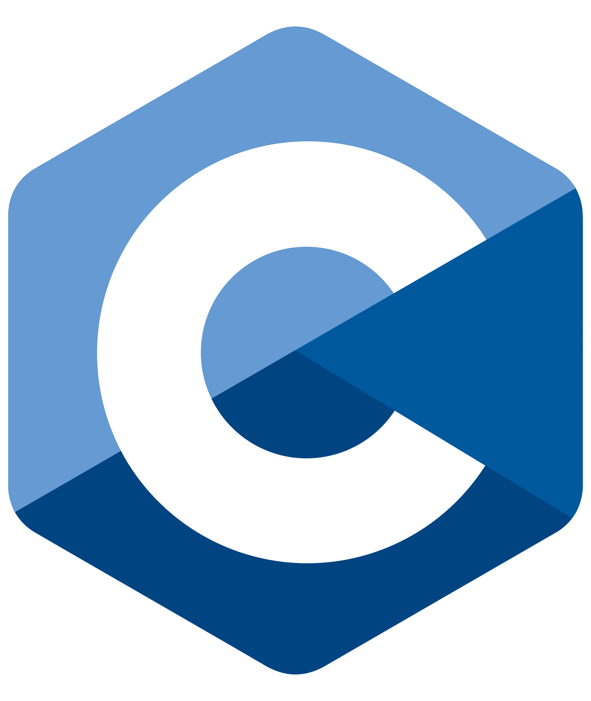
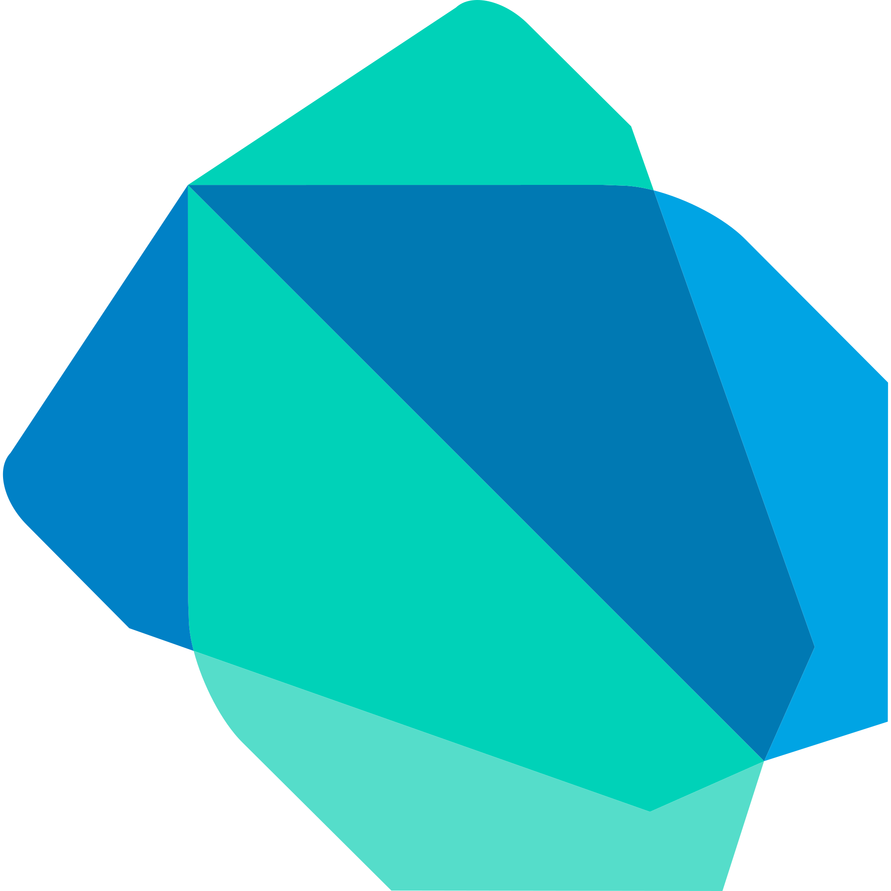
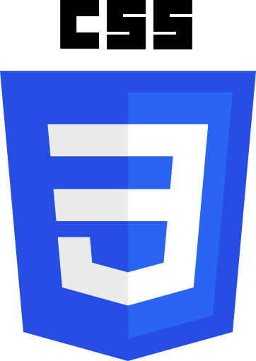

[](https://git.io/typing-svg)

[](https://www.linkedin.com/in/thinhle19/)
[](https://www.upwork.com/freelancers/~01f12733a7302716a2)
[](https://www.facebook.com/ltthinh19/)


<p align="center">
  <b>I'm a musicalholic geek</b>
</p>


<br>

- ♍ I love the process of creating things from my 10 fingers and watch them create benefits.
- 📓 I'm a student of [VNU HCMC FPT University](https://hcmuni.fpt.edu.vn).
- 🌱 I’m currently focusing on **Backend Development**.
- Show ❤ by giving ⭐ to my Repositories, at least your star could make someone's day 😄.

<!-- Tech stack -->
<h2>Tech stack 🔭</h2>
<p align="center">
  <b>Languages</b>
  <br>
  <br>
  <a href="https://en.wikipedia.org/wiki/C_(programming_language)" target="_blank">
    <code></code>
  </a>
  <a href="https://www.java.com" target="_blank">
    <code></code>
  </a>
  <a href="https://docs.microsoft.com/en-us/dotnet/csharp/" target="_blank">
    <code></code>
  </a>
  <a href="https://dart.dev/" target="_blank">
    <code></code>
  </a>
  <a href="https://developer.mozilla.org/en-US/docs/Web/JavaScript" target="_blank">
    <code></code>
  </a>
  <a href="https://www.python.org/" target="_blank">
    <code></code>
  </a>
</p>

<br>
<br>

<p align="center">
  <b>Backend</b>
  <br>
  <br>
  <a href="https://spring.io/" target="_blank">
    <code></code>
  </a> 
  <a href="https://dotnet.microsoft.com/en-us/" target="_blank">
    <code></code>
  </a> 
  <a href="https://laravel.com/" target="_blank">
    <code></code>
  </a> 
</p>

<br>
<br>

<p align="center">
  <b>Databases</b>
  <br>
  <br>
  <a href="https://www.wikiwand.com/en/Microsoft_SQL_Server" target="_blank">
    <code></code>
  </a>
  <a href="https://www.mysql.com/" target="_blank">
    <code></code>
  </a>
  <a href="https://firebase.google.com/" target="_blank">
    <code></code>
  </a>
</p>

<br>
<br>

<p align="center">
  <b>DevOps</b>
  <br>
  <br>
  <a href="https://www.docker.com/" target="_blank">
    <code></code>
  </a>
  <a href="https://nginx.org/en/" target="_blank">
    <code></code>
  </a>
  <a href="https://aws.amazon.com/" target="_blank">
    <code></code>
  </a>
  <a href="https://azure.microsoft.com/en-gb/" target="_blank">
    <code></code>
  </a>
  <a href="https://kubernetes.io/" target="_blank">
    <code></code>
  </a>
  <a href="https://sonarcloud.io/login" target="_blank">
    <code></code>
  </a>
</p>

<br>
<br>

<p align="center">
  <b>Frontend</b>
  <br>
  <br>
  <a href="https://developer.mozilla.org/en-US/docs/Web/HTML" target="_blank">
    <code></code>
  </a>
  <a href="https://developer.mozilla.org/en-US/docs/Web/CSS" target="_blank">
    <code></code>
  </a>
  <a href="https://react.dev/" target="_blank">
    <code></code>
  </a>
  <a href="https://mui.com/material-ui/" target="_blank">
    <code></code>
  </a>
  <a href="https://flutter.dev/" target="_blank">
    <code></code>
  </a>
  <br>
</p>

<br>
<br>
<!-- My activity -->
<h2>My activity </h2>
<p align="center">
  

</p>
<p align="center">
  <b>📊 Wakatime Stats</b>

  <!--START_SECTION:waka-->


**I'm a Night 🦉** 

```text
🌞 Morning                2436 commits        ⣿⣿⣿⣀⣀⣀⣀⣀⣀⣀⣀⣀⣀⣀⣀⣀⣀⣀⣀⣀⣀⣀⣀⣀⣀   11.41 % 
🌆 Daytime                5749 commits        ⣿⣿⣿⣿⣿⣿⣿⣀⣀⣀⣀⣀⣀⣀⣀⣀⣀⣀⣀⣀⣀⣀⣀⣀⣀   26.92 % 
🌃 Evening                8157 commits        ⣿⣿⣿⣿⣿⣿⣿⣿⣿⣿⣀⣀⣀⣀⣀⣀⣀⣀⣀⣀⣀⣀⣀⣀⣀   38.20 % 
🌙 Night                  5013 commits        ⣿⣿⣿⣿⣿⣿⣀⣀⣀⣀⣀⣀⣀⣀⣀⣀⣀⣀⣀⣀⣀⣀⣀⣀⣀   23.47 % 
```
📅 **I'm Most Productive on Sunday** 

```text
Monday                   3888 commits        ⣿⣿⣿⣿⣿⣀⣀⣀⣀⣀⣀⣀⣀⣀⣀⣀⣀⣀⣀⣀⣀⣀⣀⣀⣀   18.21 % 
Tuesday                  4323 commits        ⣿⣿⣿⣿⣿⣀⣀⣀⣀⣀⣀⣀⣀⣀⣀⣀⣀⣀⣀⣀⣀⣀⣀⣀⣀   20.24 % 
Wednesday                1879 commits        ⣿⣿⣀⣀⣀⣀⣀⣀⣀⣀⣀⣀⣀⣀⣀⣀⣀⣀⣀⣀⣀⣀⣀⣀⣀   08.80 % 
Thursday                 1567 commits        ⣿⣿⣀⣀⣀⣀⣀⣀⣀⣀⣀⣀⣀⣀⣀⣀⣀⣀⣀⣀⣀⣀⣀⣀⣀   07.34 % 
Friday                   2042 commits        ⣿⣿⣀⣀⣀⣀⣀⣀⣀⣀⣀⣀⣀⣀⣀⣀⣀⣀⣀⣀⣀⣀⣀⣀⣀   09.56 % 
Saturday                 2338 commits        ⣿⣿⣿⣀⣀⣀⣀⣀⣀⣀⣀⣀⣀⣀⣀⣀⣀⣀⣀⣀⣀⣀⣀⣀⣀   10.95 % 
Sunday                   5318 commits        ⣿⣿⣿⣿⣿⣿⣀⣀⣀⣀⣀⣀⣀⣀⣀⣀⣀⣀⣀⣀⣀⣀⣀⣀⣀   24.90 % 
```


📊 **This Week I Spent My Time On** 

```text
🕑︎ Time Zone: Asia/Ho_Chi_Minh

💬 Programming Languages: 
Markdown                 13 hrs 3 mins       ⣿⣿⣿⣿⣿⣿⣿⣿⣿⣿⣿⣿⣿⣿⣿⣀⣀⣀⣀⣀⣀⣀⣀⣀⣀   59.47 % 
TypeScript               3 hrs 47 mins       ⣿⣿⣿⣿⣀⣀⣀⣀⣀⣀⣀⣀⣀⣀⣀⣀⣀⣀⣀⣀⣀⣀⣀⣀⣀   17.27 % 
C#                       1 hr 35 mins        ⣿⣿⣀⣀⣀⣀⣀⣀⣀⣀⣀⣀⣀⣀⣀⣀⣀⣀⣀⣀⣀⣀⣀⣀⣀   07.29 % 
JavaScript               1 hr                ⣿⣀⣀⣀⣀⣀⣀⣀⣀⣀⣀⣀⣀⣀⣀⣀⣀⣀⣀⣀⣀⣀⣀⣀⣀   04.58 % 
JSON                     53 mins             ⣿⣀⣀⣀⣀⣀⣀⣀⣀⣀⣀⣀⣀⣀⣀⣀⣀⣀⣀⣀⣀⣀⣀⣀⣀   04.07 % 

🔥 Editors: 
VS Code                  7 hrs 35 mins       ⣿⣿⣿⣿⣿⣿⣿⣿⣿⣀⣀⣀⣀⣀⣀⣀⣀⣀⣀⣀⣀⣀⣀⣀⣀   34.56 % 
Codex CLI                7 hrs 14 mins       ⣿⣿⣿⣿⣿⣿⣿⣿⣀⣀⣀⣀⣀⣀⣀⣀⣀⣀⣀⣀⣀⣀⣀⣀⣀   33.01 % 
Codex Vscode             7 hrs 7 mins        ⣿⣿⣿⣿⣿⣿⣿⣿⣀⣀⣀⣀⣀⣀⣀⣀⣀⣀⣀⣀⣀⣀⣀⣀⣀   32.43 % 
```

🤖 **AI Coding This Week** 

```text
⏱ AI Coding Time: 20 hrs 4 mins (91.49%)

✍️ 18,401 lines written by AI, 267 lines written by hand (98.57% AI-written)

🔤 10,731,102 Input Tokens, 1,409,724 Output Tokens

💵 $264.95 Estimated AI Cost This Week

🧠 154 AI Sessions, 583 AI Prompts

GPT                      13,884 lines        ⣿⣿⣿⣿⣿⣿⣿⣿⣿⣿⣿⣿⣿⣿⣿⣿⣿⣿⣿⣀⣀⣀⣀⣀⣀   74.07 % 
K                        4,860 lines         ⣿⣿⣿⣿⣿⣿⣀⣀⣀⣀⣀⣀⣀⣀⣀⣀⣀⣀⣀⣀⣀⣀⣀⣀⣀   25.93 % 
Opencode-Cli             0 lines             ⣀⣀⣀⣀⣀⣀⣀⣀⣀⣀⣀⣀⣀⣀⣀⣀⣀⣀⣀⣀⣀⣀⣀⣀⣀   00.00 % 
Codex-Vscode             0 lines             ⣀⣀⣀⣀⣀⣀⣀⣀⣀⣀⣀⣀⣀⣀⣀⣀⣀⣀⣀⣀⣀⣀⣀⣀⣀   00.00 % 
Qwen                     0 lines             ⣀⣀⣀⣀⣀⣀⣀⣀⣀⣀⣀⣀⣀⣀⣀⣀⣀⣀⣀⣀⣀⣀⣀⣀⣀   00.00 % 

🔎 AI Coding Insights:
🤖 AI-Driven — 98.57% of written lines came from AI
📚 Verbose Prompter — average 4,069 characters per prompt
🔁 Iterative Prompter — average 4 prompts per session
🚀 High AI Trust — 1.84% of changed lines were hand-edited
```


<!--END_SECTION:waka-->
</p>
